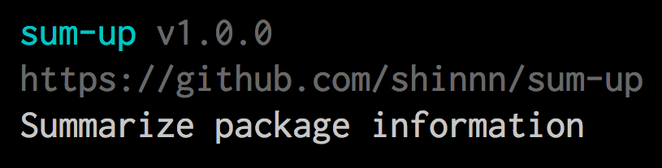

# sum-up

[](https://www.npmjs.com/package/sum-up)
[](https://travis-ci.org/shinnn/sum-up)
[](https://coveralls.io/r/shinnn/sum-up)

Summarize package information

```javascript
const sumUp = require('sum-up');
console.log(sumUp(require('./package.json')));
```



It helps your CLI tool to display information with `--help` flag.

## Installation

[Use npm.](https://docs.npmjs.com/cli/install)

```
npm install sum-up
```

## API

```javascript
const sumUp = require('sum-up');
```

### sumUp(*pkgData* [, *option*])

*pkgData*: `Object`  
*option*: `Object`  
Return: `string`

It joins the `name`, `version`, `homepage` and `description` properties (all is optional) of the first argument into a string colorized with [ANSI escape code](https://github.com/sindresorhus/ansi-styles).

#### option.color

Type: `boolean`  
Default: `true` if [the environment supports colors](https://github.com/sindresorhus/supports-color), otherwise `false`

`false` omits all ANSI escape code from the string.

```javascript
const data = {
  name: 'cli-name',
  version: '0.6.11',
  description: 'My CLI tool.'
}

sumUp(data); //=> '\u001b[36mcli-name\u001b[39m \u001b[90mv0.6.11\u001b[39m\nMy CLI tool.'
sumUp(data, {color: false}); //=> 'cli-name v0.6.11\nMy CLI tool.'
```

## License

[ISC License](./LICENSE) © 2017 Shinnosuke Watanabe
